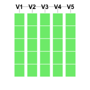
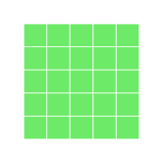
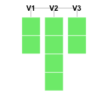
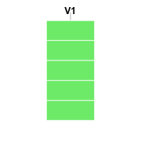
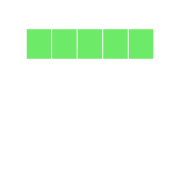

---
title: rblocks Package v 0.1
date: "2014-03-14"
config: "../config.yml"
card: True
disqus: True
description: >
  This is a revised post on rblocks, based on some excellent suggestions from Hadley Wickham, Paul Murell and others, on how to enrich the visual representation of data structures. I have also combined some `d3js` goodness, that you can see towards the end of the post! Read on, if this interests you!
--- &article2


.message [rblocks](http://github.com/ramnathv/rblocks) is an R package that provides a fun and visual tool to explore data structures and control flow in R. It is a port of [ipythonblocks](http://ipythonblocks.org). 

From the time I blogged about [rblocks](../rblocks), there have been some excellent suggestions from the community, [Hadley Wickham](http://had.co.nz) and [Paul Murrell](https://www.stat.auckland.ac.nz/~paul/) in particular. One of the major points made was that R has several data structures and it would help to be able to distinguish between these. 

While I was scratching my head on how I could represent them in visually distinct ways, Hadley pointed me to this [excellent resource](https://www.stat.auckland.ac.nz/~paul/ItDT/HTML/node64.html#SECTION001340200000000000000) from Paul Murrell, where he had already presented an elegant visual representation of the different structures.

Armed with this knowledge, I refactored my code, and bundled it into a package. The API is still highly fluid, but if you want to play with it, please use `devtools` and install from `github`.

```r
devtools::install_github('rblocks', 'ramnathv')
```

### Basics

Let us start by creating different data structures and visualizing them. I refactored `block_grid` into a `make_block` function, which accepts either dimensions and type of data structure as inputs, or an actual data object, which then gets converted into a block object.


```r
library(rblocks)
b_dataframe <- make_block(5, 5, type = "data.frame")
b_dataframe
b_matrix <- make_block(5, 5, type = "matrix")
b_matrix
b_list <- make_block(list(x = 1:2, y = LETTERS[1:4], z = c(T, F)))
b_list
b_vector <- make_block(5, type = "vector")
b_vector
```




This representation has the advantage of distinguishing between data structures. This allows us to explore some subtleties in indexing in R. For example, the difference between the `[[` and `[` operator for lists can quite confusing to a beginner, and can be explained using the following example.


```r
display(b_list[[1]])
display(b_list[1])
```


Another subtlety, it lets us explore is how some indexing operators coerce data structures. For eample, consider the difference between the following statements.


```r
display(b_dataframe[1])
display(b_dataframe[, 1])
display(b_dataframe[, 1, drop = FALSE])
```




Given my passion for interactive data visualizations, I have also started a `d3` backend to visualize these data structures (thanks to http://bl.ocks.org/Caged/6476579, I just had to tweak some d3 code!). It requires installation of my [rCharts](http://rcharts.io) package currently. Hover on top of the cells and you will see that the coordinates show up in a tooltip. I suspect, that the d3 representation will allow us to do more powerful stuff, although my ideas on what to do with this, are currently limited.


```r
library(rCharts)
display_d3(b_dataframe)
```

<iframe src='
assets/fig/unnamed-chunk-4.html
' scrolling='no' seamless
class='rChart d3block '
id=iframe-
chart8ec9406f5c34
></iframe>
<style>iframe.rChart{ width: 100%; height: 400px;}</style>


```r
b_dataframe2 = b_dataframe
b_dataframe2[1] <- "red"
display_d3(b_dataframe2)
```

<iframe src='
assets/fig/unnamed-chunk-5.html
' scrolling='no' seamless
class='rChart d3block '
id=iframe-
chart8ec94f0e7af8
></iframe>
<style>iframe.rChart{ width: 100%; height: 400px;}</style>


This package is still in very initial stages. The API is far from stable, and I am sure there are lots of bugs. One reason for posting this package at such an initial stage is that I strongly believe a package of this kind can benefit significantly from feedback and contributions at an early stage.

Working on this package has been fun as it falls at the intersection of my passions: R, teaching and data visualization. Moreover, it has helped me improve my own understanding of the idiosyncracies of indexing in R.


<style>
 p{text-align: justify;}
 iframe.rChart{height: 220px;}
</style>

