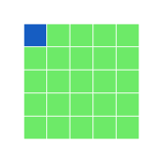
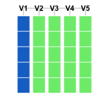

---
title: rBlocks
date: "2014-03-12"
config: "../config.yml"
card: True
disqus: True
description: >
  This is a post on my experiment at trying to create a visual tool to teach R. It is motivated by the highly talked about ipythonblocks. 
--- &article2


.message [rBlocks](rblocks.R) is an attempted port of [ipythonblocks](http://nbviewer.ipython.org/github/jiffyclub/ipythonblocks/blob/master/demos/ipythonblocks_demo.ipynb) to R, to provide a fun and visual tool to explore data structures and control flow.

<div style='display:block; margin: auto auto;'>




</div>

One of the challenges associated with learning any programming language is being able to access and manipulate data structures. I have often heard from students that they find it hard to understand the different ways of slicing and dicing data in R. 

As I researched different solutions to teach these concepts more effectively, I chanced upon the wonderful world of [ipythonblocks](http://nbviewer.ipython.org/github/jiffyclub/ipythonblocks/blob/master/demos/ipythonblocks_demo.ipynb). Here is a brief description of the tool by its creator [Matt Davis](http://penandpants.com/).

.message ipythonblocks is a teaching tool that allows students to experiment with Python flow control concepts and immediately see the effects of their code represented in a colorful, attractive way. 

The more I explored ipythonblocks, the more I became convinced that it is a wonderful way to introduce basic concepts of a programming language in a fun and visual manner. I wanted to bring this tool to the world of R, and so I created [rBlocks](rblocks.R). 

Currently, it is just a set of functions, but I plan to develop it into a full fledged package. So why am I blogging about it now, if it is still work-not-ready-to-be-shown? Well, I am looking to share what I have done so far, give you a demo of what concepts of the language it can help explain, and most importantly seek feedback and attract contributions!

Without any further talk, let me dig straight into rBlocks. If you want to follow along, please download [rBlocks.R](rblocks.R) and source it into your workspace.

### Vectors

The workhorse function in rBlocks is `block_grid`, which creates a data structure. It currently supports creating a `vector`, `matrix` and `data.frame`. Let us use `block_grid` to create a vector and see how we can use it to illustrate some concepts of programming.


```r
grid1 <- block_grid(5, type = "vector")
grid1
```

 


So how can we use this to teach indexing? Well, for starters, we can show the different ways to access elements of a vector (using positive integers, negative integers, logical vectors etc. as indices)


```r
## index using positive integers
grid1[1:2] <- "red"
grid1
```

 

```r

# index using negative integers
grid2 <- block_grid(5, type = "vector")
grid2[-c(1:3)] <- "blue"
grid2
```

 

```r

# index using logical vectors
grid3 <- block_grid(5, type = "vector")
grid3[c(T, F, T, F, T)] <- "darkred"
grid3
```

 


One challenging concept for those new to R is the [recycling rule](http://cran.r-project.org/doc/manuals/R-intro.html#The-recycling-rule). rBlocks can be used to explain this concept visually. 


```r
grid4 <- block_grid(5, type = "vector")
grid4[c(T, F)] <- "blue"
grid4
```

 


In this example, we are using a logical vector `c(T, F)` to access elements of the vector `grid4`. According to the recycling rule, this short vector is expanded out as `c(T, F, T, F, T)` to match the length of `grid4`. The grid image makes on top makes it easy to understand what is happening.

### Control Structures

rBlocks can be used to motivate users to learn about basic control structures. For this example, we will create a `matrix` and write a `for` loop to set elements on the diagonal to the color `firebrick` (thanks to [Alyssa Frazee](alyssafrazee.com) and the [RSkittleBrewer](http://alyssafrazee.com/RSkittleBrewer.html)  package for making me more color aware).


```r
grid5 <- block_grid(5, 5, type = "matrix")
for (i in 1:5) {
    grid5[i, i] <- "firebrick"
}
grid5
```

 


It can be used to explain subtle differences between indexing `data.frames` and `matrices` like in the example below.


```r
# single index accesses first element of matrix
grid6 <- block_grid(5, 5, type = "matrix")
grid6[1] <- "dodgerblue3"
grid6
# single index accesses first column of data.frame
grid7 <- block_grid(5, 5, type = "data.frame")
grid7[1] <- "dodgerblue3"
grid7
```


We can use it to teach about `apply` functions. For example, let us use `apply` to change the light green cells in `grid7` to `olivedrab` and the blue cells to `darkslategray`.


```r
grid8 = apply(grid7, 2, function(df) {
    if (sum(df == "dodgerblue3") == 5) {
        df[] = "darkslategrey"
    } else {
        df[] = "olivedrab"
    }
    return(df)
})
display(grid8)
```

 


.message We need the `display` function here, since `apply` drops attributes, and my implementation of the grid needs the object to be marked with the `block` class to overlod the print method (I am sure there are more elegant implementations that can handle this better, without bothering the user. Any thoughts?)

One of the gotchas in R is how it coerces data structures when subsetting. Here is a simple way to visualize this behavior with `data.frames`.


```r
grid9 = block_grid(5, 5)
# extracting the first column converts it to a vector
grid10 = grid9[, 1]

grid9
display(grid10)
```


I can go on-and-on, but I think you get my message. What I have shown is barely scratching the surface. So, what is my vision with this package? 

1. For starters, I want a more robust implementation of the core functions so that it prints as a grid no matter what operations a user runs on it! I like the ipythonblocks API, and so something closer to it would be awesome.

2. I want to be able to model more data structures. For example, `lists` and `arrays`. A visual model for `lists` would allow clarifying the difference between `[[` and `[`!

3. A better visual grid. Maybe `d3js` with hover, some text labels displaying actual data? What about some animation to visualize a loop or an `lapply` call.

4. Finally, a mechanism that would allow R users to submit examples illustrating different concepts using `rBlocks` that teachers of the language can fork and reuse for their own lessons.

I might be way-off with my wish-list, but this is my way of giving back to the wonderful R community that has given me so much! I am open to feedback, suggestions and contributions!


<style>
 p {text-align: justify;}
</style>

